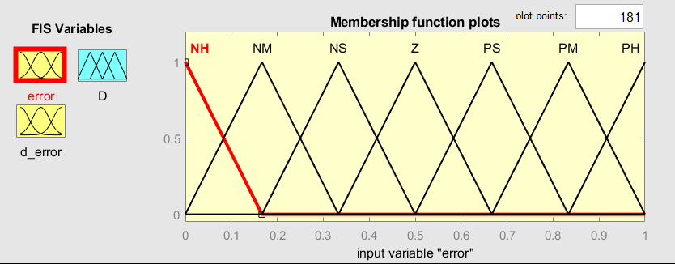
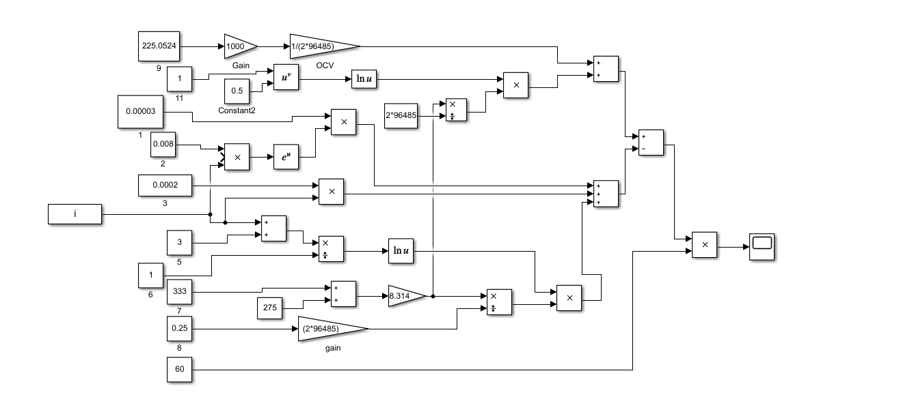
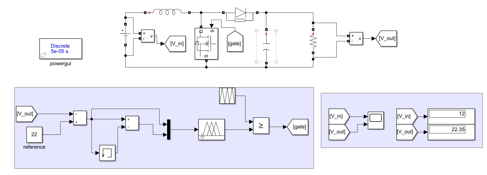

This project simulates a PEM fuel cell stack that generates a variable DC voltage and uses a DC–DC converter with a fuzzy logic controller to regulate the converter output voltage to a reference value.

---

## Key features
- PEM fuel cell **stack voltage** simulation under a varying current density profile
- DC–DC converter driven by the PEM stack voltage as **Vin(t)**
- Fuzzy logic controller that adjusts converter **duty cycle (D)** to regulate **Vout**
- Scripts to run simulations and visualize fuzzy membership functions and control surface

---

## Core equations (model context)

### Cell and stack voltage
$$
V_{\text{cell}}(i)=E_{\text{OCV}}(T,P)-\eta_{\text{act}}(i)-\eta_{\text{ohm}}(i)-\eta_{\text{conc}}(i)
$$

$$
V_{\text{stack}}(t)=N_{\text{cells}}\,V_{\text{cell}}(i(t))
$$

### Typical loss terms
**Ohmic loss:**
$
\eta_{\text{ohm}}(i)=i\,R_{\text{ohm}}
$

**Activation loss:**
$$
\eta_{\text{act}}(i)=\frac{RT}{\alpha F}\ln\!\left(\frac{i}{i_0}\right)
$$

**Concentration loss:**
$$
\eta_{\text{conc}}(i)=-\frac{RT}{nF}\ln\!\left(1-\frac{i}{i_{\text{lim}}}\right)
$$

### Nernst open-circuit voltage
$$
E_{\text{OCV}}=E_0+\frac{RT}{2F}\ln\!\left(\frac{p_{H_2}\,p_{O_2}^{1/2}}{p_{H_2O}}\right)
$$

### Stack power
$$
P_{\text{stack}}(t)=V_{\text{stack}}(t)\,I(t)
$$

---

## DC–DC converter relations 


**Boost converter (ideal):**
$$
V_{\text{out}}\approx \frac{V_{\text{in}}}{1-D}
$$

Where \(D \in [0,1]\) is the PWM duty cycle.

---

## Fuzzy controller signals 

**Voltage error and change-in-error:**

$$
e(k)=V_{\text{ref}}-V_{\text{out}}(k), \qquad \Delta e(k)=e(k)-e(k-1)
$$

Fuzzy controller output:
- \(D(k)\): duty cycle command used by the PWM/gate driver

---

## Folder structure
```text
pem-fuelcell-dcdc-fuzzy/
│  README.md
├─ models/
│  ├─ PEMcell.slx        # PEM fuel cell model
│  └─ DCDCconv.slx       # DC–DC converter + fuzzy controller model
├─ fis/
│  └─ fzylgcfis.fis      # fuzzy controller definition
├─ scripts/
│  ├─ setup.m            # adds paths, loads FIS, creates input i, sets Vref
│  ├─ run_pemcell_01.m   # runs PEM model and plots/saves V_stack
│  ├─ dcdc_002.m         # creates Vin(t) timeseries from PEM stack voltage
│  ├─ dcdc_run.m         # runs DC–DC model using V_stack as Vin
│  └─ plot_fis.m         # plots membership functions + control surface
└─ docs/
   └─ (paper, screenshots)
```

---

## What signals mean
- **V_stack / V_in**: input voltage to the converter (from PEM stack)
- **V_out**: regulated converter output voltage (target ≈ 22 V)
- **D**: duty cycle output of the fuzzy controller (0–1)
- **gate**: PWM switching signal applied to the converter switch

---

## Requirements
- MATLAB / Simulink
- Fuzzy Logic Toolbox

---

## How to run
1. Open MATLAB
2. `cd` into this repo folder
3. Run the scripts below (in order):

```matlab
run("scripts/setup.m")
run("scripts/run_pemcell_01.m")
run("scripts/dcdc_002.m")
run("scripts/dcdc_run.m")
run("scripts/plot_fis.m")
```

### What gets created (workspace outputs)
- `fzylgcfis` : fuzzy controller object
- `i` : current density input for PEM model
- `Vref` : reference output voltage
- `Vin` / `Vstack_ts` : time-varying input voltage for the DC–DC converter
- `out_dcdc` : `SimulationOutput` from the converter model

---

```md




```
